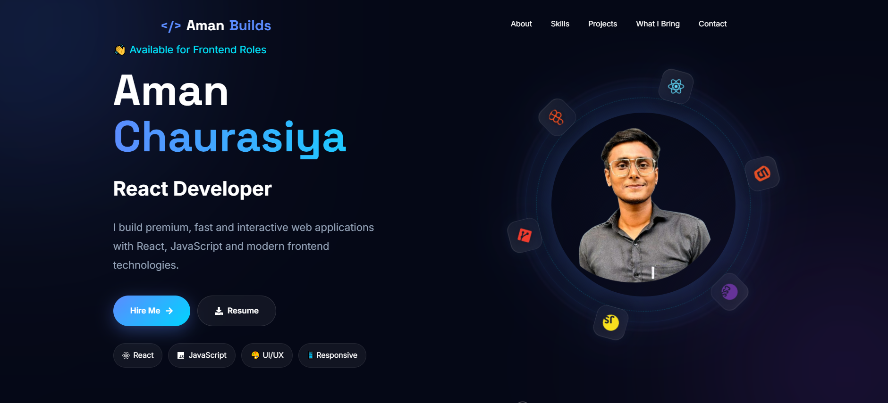
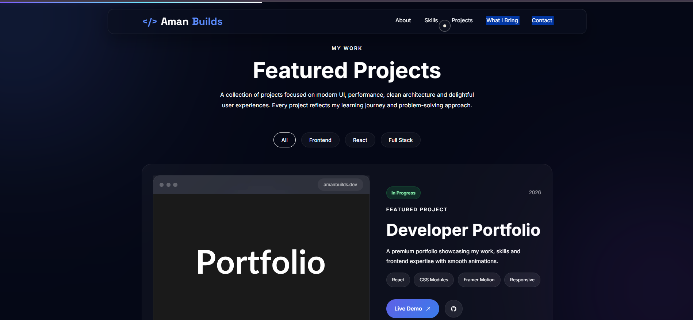
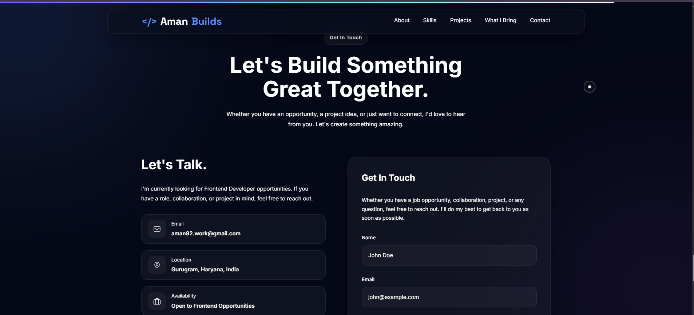

# 💼 Aman Chaurasiya | Frontend Developer Portfolio

A modern, premium and fully responsive developer portfolio built using **React + Vite** with smooth animations, glassmorphism UI and clean component architecture.

## 🌐 Live Demo

> portfolio-6e2iqly51-aman-biulds.vercel.app

## 📸 Project Preview

### Hero Section



---

### Projects Section



---

### Contact Section



---

## ✨ Features

- Modern Premium UI
- Fully Responsive Design
- Smooth Framer Motion Animations
- Glassmorphism Effects
- Custom Cursor
- Animated Skills Section
- Interactive Project Cards
- Contact Form (EmailJS)
- Resume Download
- GitHub & LinkedIn Integration
- Clean Component Architecture
- SEO Friendly Structure

---

## 🛠 Tech Stack

### Frontend

- React.js
- Vite
- JavaScript (ES6+)
- CSS Modules

### Animation

- Framer Motion

### Icons

- React Icons

### Email Service

- EmailJS

### Version Control

- Git & GitHub

---

## 📂 Folder Structure

```text
src/
│
├── assets/
├── animations/
├── components/
│   ├── Navbar/
│   ├── Hero/
│   ├── About/
│   ├── Skills/
│   ├── Projects/
│   ├── WhatIBring/
│   ├── Contact/
│   ├── Footer/
│   └── Common/
│
├── data/
├── styles/
└── App.jsx
```

---

## 🚀 Getting Started

Clone the repository

```bash
git clone https://github.com/AmanBuilds/Portfolio.git
```

Go to project folder

```bash
cd Portfolio
```

Install dependencies

```bash
npm install
```

Run development server

```bash
npm run dev
```

Build for production

```bash
npm run build
```

---

## 👨‍💻 About Me

Hi, I'm **Aman Chaurasiya**, a Frontend Developer passionate about building modern, responsive and user-focused web applications.

I'm currently expanding my skills in:

- Next.js
- Node.js
- Express.js
- MongoDB
- TypeScript

---

## 📬 Connect With Me

- GitHub: https://github.com/AmanBuilds
- LinkedIn: https://www.linkedin.com/in/amanchaurasiya03/

---

## ⭐ Support

If you like this project, consider giving it a ⭐ on GitHub.

---

Made with ❤️ by **Aman Chaurasiya**
